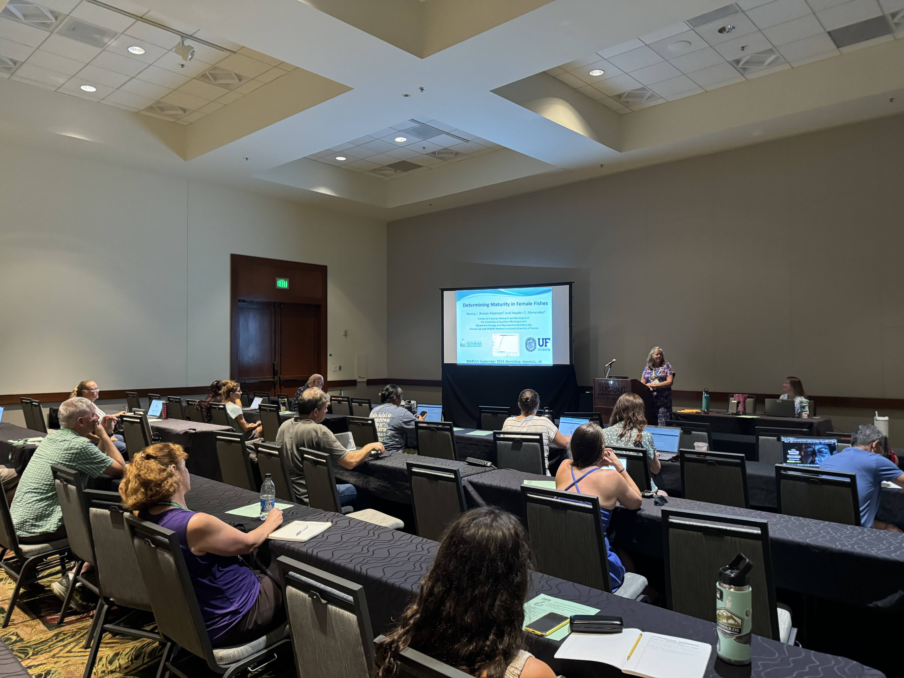
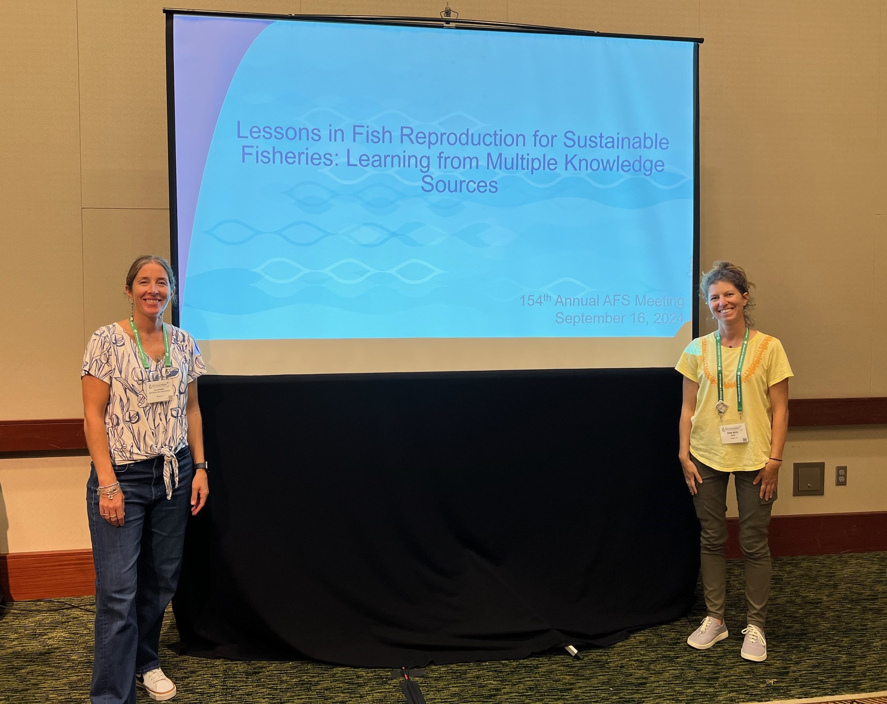
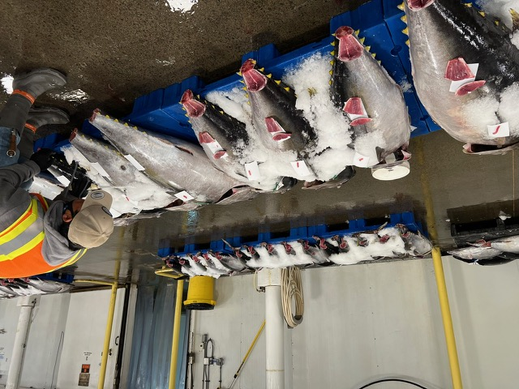

```{r setup, include=FALSE}
knitr::opts_chunk$set(echo = FALSE)
```

## 2024

The NOAA Pacific Islands Fisheries Science Center hosted the 5th biennial meeting for the Maturity Assessment Reproductive Variability and Life Strategies (MARVLS) working group in conjunction with the [National Meeting of the American Fisheries Society in Honolulu in September 14 - 20, 2024](https://afsannualmeeting.fisheries.org/).

Workshop Events

* Saturday September 14: Cultural site visit to Hawaiian Fish Pond - Paepae O He'eia. 

{width="70%"}

* Sunday September 15: MARVLS histology workshop and AFS Continuing education course “Interpreting Reproductive Histology: Female Maturity and Reproductive Phases” led by Nancy Brown-Peterson and Hayden Menendez from 1-5pm at the Honolulu Convention Center.  This was a more formal version of a gonad histology workshop, and Nancy and Hayden reached out for materials from other scientists working on fishes outside the southeast US region. Their presentation assembled these diverse descriptions and showed where and how much it matters when calculating point estimates of size and age at maturity.  Workshop presentation and materials are available [here](https://drive.google.com/drive/folders/1wVYM5Hk6_CK8vn4Gx2egGTXzDEGEs-ez). 

{width="70%"}

* Monday September 16 8:00 am -5:30 pm: AFS MARVLS symposium “Lessons in fish reproduction for sustainable fisheries: learning from multiple knowledge sources.” [Link to AFS agenda](https://www.xcdsystem.com/afs/program/y7rKVr9/index.cfm). 

{width="70%"}

* Tuesday September 17 - Thursday 19: AFS conference at the Honolulu Convention Center. 

* Wednesday September 18: Honolulu Fish Auction
As the sun rose, Russ Ito (PIFSC) got us oriented to local, federal fisheries, particularly the large pelagics of the Pacific. He shared his experience and knowledge as we walked into the fish auction. The buyers, sellers, and dockworkers performed choreographed movements around large pallets of fish.

{width="70%"}


* Friday September 20: NOAA Pacific Islands Fisheries Science Center Daniel K. Inouye Regional Center. 


## 2023
2023 Joint NSAW & MARVLS meeting (May 9-11, 2023). [Proceedings are available at NOAA library here](https://spo.nmfs.noaa.gov/content/tech-memo/proceedings-14th-national-stock-assessment-workshop-and-4th-biennial-meeting).


{width="70%"}


MARVLS visits the NMFS-NEFSC Woods Hole Lab for the day, May 11, 2023. Back row (l-r): D. Wyanski (SC-DNR), J. O’Malley (PIFSC), K. Kolmos (SC-DNR), C. Jones (IPHC), C. Conrath (AFSC), Y. Press (NEFSC [IBSS]), K. James (SWFSC), M. Wuenschel (NEFSC). Next row: R. McBride (NEFSC), R. Rideout (DFO), W. Sinkus (SC-DNR), N. Brown-Peterson, E. Tholke (NEFSC [IBSS]), C. Rosemond (OSU), L. Munoz Abril (DISL), M. Passerotti (NEFSC), L. Lefebvre (WHOI). Front Row: K. Lesyna (DCFW), H. Conrad (VT), A. Pacicco (SEFSC [CIMAS]), B. Erisman (SWFSC), R. Dominguez-Petit (IEO-CSIC [Spain]), C. Wells (SC-DNR), M. Taliercio (SC-DNR), E. Reed (PIFSC), C. Rodgeveller (AFSC), S. Beyer (UW), H. Moncrief-Cox (SEFSC [CIMAS]), E. Schemmel (PIFSC). Missing: N. Klibansky (SEFSC), B. Linton (NEFSC), S. McDermott (AFSC), S. Neidetcher (AFSC), E. Slesinger (AFSC-OSU).

        
## 2020

2020 Joint NSAW & MARVLS meeting: 4th National MARVLS Workshop rescheduled. In-person workshop canceled but a [virtual histology workshop was held](https://drive.google.com/drive/folders/1ppjix93fNMTv-5erjq1g_DGwFSxqWD_x?usp=sharing). [Results from virtual histology workshop](https://drive.google.com/file/d/1j2g_dVYebEBHjM1J1d2lgWCNZWcnH9KP/view?usp=sharing)

## 2018

[2018 Panama City, Florida 3rd National MARVLS Workshop](https://drive.google.com/drive/folders/1Xr8jURdwEWCAR9NUYV7gyZpB193bAZa3?usp=sharing)

## 2016

[2016 La,Jolla, 2nd National MARVLS Workshop](https://drive.google.com/drive/folders/1ue8ok_pfyLgiFP8KUREhAE4Qba9DdFGf?usp=sharing)

## 2014

[2014 1st National MARVLS Workshop](https://drive.google.com/drive/folders/1udJwD4FAgSxu1fbDjWqon4x_inZrr8WI?usp=sharing)
