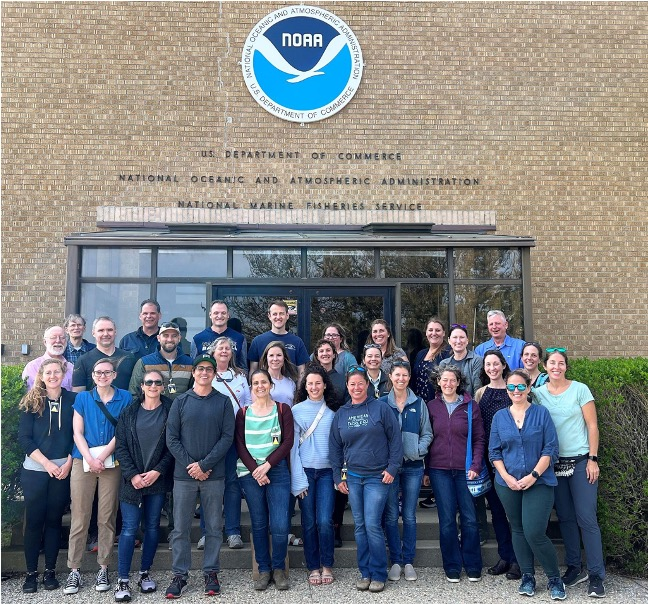

```{r setup, include=FALSE}
knitr::opts_chunk$set(echo = FALSE)
```

## 2024
MARVLS 2024 meeting will be held in conjunction with the [American Fisheries Society Annual Meeting in Honolulu from Sept 14-Sept 20](https://afsannualmeeting.fisheries.org/). 

Sunday September 15: MARVLS histology workshop and AFS Continuing education course “Interpreting Reproductive Histology: Female Maturity and Reproductive Phases” led by Nancy Brown-Peterson and Hayden Menendez from 1-5pm at the Honolulu Convention Center.  Workshop Overview and Slide Submission Folders and more details are available [here](https://drive.google.com/drive/folders/1wVYM5Hk6_CK8vn4Gx2egGTXzDEGEs-ez). 

Since this workshop is part of the AFS program, there is a workshop registration fee of $90 for regular AFS members ($150 for non AFS members), $65 for AFS student members ($75 for non-members) and $75 for early career AFS members.  Some of this registration fee will be returned to the newly formed AFS Pacific Islands AFS chapter (co-host of the national AFS meeting this year) to help support their regional meetings and local fisheries. We hope that this registration fee will not discourage MARVLS folks from attending the workshop.
Participants are encouraged to submit summary Google slides (using the MARVLS template, see below for more information) following a standardized format that includes relevant information on species, gonadal stage, and structures of interest. The slides will be organized by the activity facilitators into two groups: 1. “Maturity” or 2. “Other Slides”. The collection of Google slides will be shared with all participants and made available prior to the meeting. 

Slides uploaded to the “Maturity” folder will be used in the first part of the Workshop to illustrate how to differentiate between immature and regenerating individuals for a variety of species.  Slides should be uploaded no later than 15 August 2024 to be included in the Maturity portion of the workshop. 

Photographs of “Other Slides” should be uploaded to the “Other Slides” folder. Researchers are welcome to contribute slides to this folder on which they have questions on structures present or on how to interpret the slide, slides that highlight particular stages or structures (e.g. atresia, POFs) and slides that show unusual or atypical structures or phenomena (e.g. fixation/processing artifacts, mass atresia, parasitism).  These photographs should be uploaded no later than 7 September.  We will attempt to show all of these slides during the second half of the workshop, although extended discussions may result in some slides not being shown.


## 2023
2023 Joint NSAW & MARVLS meeting (May 9-11, 2023). [Proceedings are available at NOAA library here](https://spo.nmfs.noaa.gov/content/tech-memo/proceedings-14th-national-stock-assessment-workshop-and-4th-biennial-meeting).


{width="70%"}


MARVLS visits the NMFS-NEFSC Woods Hole Lab for the day, May 11, 2023. Back row (l-r): D. Wyanski (SC-DNR), J. O’Malley (PIFSC), K. Kolmos (SC-DNR), C. Jones (IPHC), C. Conrath (AFSC), Y. Press (NEFSC [IBSS]), K. James (SWFSC), M. Wuenschel (NEFSC). Next row: R. McBride (NEFSC), R. Rideout (DFO), W. Sinkus (SC-DNR), N. Brown-Peterson, E. Tholke (NEFSC [IBSS]), C. Rosemond (OSU), L. Munoz Abril (DISL), M. Passerotti (NEFSC), L. Lefebvre (WHOI). Front Row: K. Lesyna (DCFW), H. Conrad (VT), A. Pacicco (SEFSC [CIMAS]), B. Erisman (SWFSC), R. Dominguez-Petit (IEO-CSIC [Spain]), C. Wells (SC-DNR), M. Taliercio (SC-DNR), E. Reed (PIFSC), C. Rodgeveller (AFSC), S. Beyer (UW), H. Moncrief-Cox (SEFSC [CIMAS]), E. Schemmel (PIFSC). Missing: N. Klibansky (SEFSC), B. Linton (NEFSC), S. McDermott (AFSC), S. Neidetcher (AFSC), E. Slesinger (AFSC-OSU).

        
## 2020

2020 Joint NSAW & MARVLS meeting: 4th National MARVLS Workshop rescheduled. In-person workshop canceled but a [virtual histology workshop was held](https://drive.google.com/drive/folders/1ppjix93fNMTv-5erjq1g_DGwFSxqWD_x?usp=sharing). [Results from virtual histology workshop](https://drive.google.com/file/d/1j2g_dVYebEBHjM1J1d2lgWCNZWcnH9KP/view?usp=sharing)

## 2018

[2018 Panama City, Florida 3rd National MARVLS Workshop](https://drive.google.com/drive/folders/1Xr8jURdwEWCAR9NUYV7gyZpB193bAZa3?usp=sharing)

## 2016

[2016 La,Jolla, 2nd National MARVLS Workshop](https://drive.google.com/drive/folders/1ue8ok_pfyLgiFP8KUREhAE4Qba9DdFGf?usp=sharing)

## 2014

[2014 1st National MARVLS Workshop](https://drive.google.com/drive/folders/1udJwD4FAgSxu1fbDjWqon4x_inZrr8WI?usp=sharing)
